# Maternal Continuum of Care in Nigeria

**An end-to-end health analytics project using the 2024 Nigeria Demographic and Health Survey (NDHS), R, PostgreSQL/SQL, and Power BI.**

This project examines how women move through the maternal continuum of care in Nigeria, from antenatal care through skilled delivery and early postnatal care. It combines survey-weighted public-health analysis, equity and geographic comparisons, multivariable modelling, sensitivity analysis, a PostgreSQL reporting layer, and an interactive Power BI report.

> **Primary outcome:** completion of at least four antenatal care contacts, skilled birth attendance, and early postnatal care for both mother and newborn within two days of birth.

## Project at a glance

| Component | Summary |
|---|---|
| Data source | 2024 Nigeria Demographic and Health Survey (NDHS) |
| Analytical cohort | 10,522 most recent live births within the preceding 24 months |
| Model complete cases | 10,236 |
| Geographic coverage | 36 states + FCT |
| Core national indicators | 14 |
| Public equity estimates | 192 |
| State-level indicator estimates | 296 |
| Tools | R, PostgreSQL/SQL, Power BI, Git/GitHub |
| Final QA status | **PASS — 0 critical failures** |

## Why this project matters

Maternal care is not a single contact with the health system. A woman may begin antenatal care but fail to receive enough contacts, deliver without skilled attendance, or miss timely postnatal care. Looking only at individual indicators can therefore hide losses across the full pathway.

This project asks four practical questions:

1. How much of the maternal-care pathway is completed nationally?
2. Where do the largest drop-offs occur?
3. How unequal is completion across education, wealth, residence, age, geopolitical zone, and state?
4. Which socioeconomic and geographic characteristics remain associated with complete continuum coverage after adjustment?

## Selected findings

- **73.7%** of women received any antenatal care, but only **53.6%** received four or more ANC contacts.
- Skilled birth attendance was **45.1%**, facility delivery **42.9%**, and paired mother-newborn PNC within two days **38.1%**.
- Only **24.5%** completed the primary ANC4 + skilled birth + paired PNC continuum.
- The complete-continuum gap was **63.2 percentage points by education**, **61.2 points by wealth quintile**, **53.3 points by geopolitical zone**, and **30.0 points by residence**.
- State-level complete-continuum coverage ranged from **72.7% in Lagos** to **3.3% in Kebbi** in the public reporting output.
- In the adjusted survey-weighted model, higher education and higher wealth showed strong positive associations with completion. For example, higher education had an adjusted odds ratio of **6.32** versus no education, and the richest quintile **6.31** versus the poorest quintile.
- Sensitivity analyses were directionally consistent. Replacing ANC4 with ANC8 reduced continuum prevalence to **11.0%**, while replacing skilled birth with facility delivery produced a prevalence of **24.6%**.

These are **associations and descriptive estimates, not causal effects**.

## Analytical architecture

```mermaid
flowchart LR
    A[Authorised 2024 NDHS microdata] --> B[R: import, audit & cohort derivation]
    B --> C[R: survey-weighted national estimates]
    C --> D[R: equity & geographic analysis]
    D --> E[R: regression & sensitivity analysis]
    E --> F[Validated aggregate CSV outputs]
    F --> G[PostgreSQL staging]
    G --> H[Analytics tables]
    H --> I[Reporting views]
    I --> J[Power BI semantic model]
    J --> K[9-page maternal-health intelligence report]
```



## Power BI report

The final Power BI report contains nine pages:

1. Executive Overview
2. National Indicators
3. Continuum of Care
4. Equity Analysis
5. Equity Gaps
6. Geographic Analysis
7. Regression Results
8. Sensitivity & Robustness
9. About & Methodology

The final report was developed in Power BI Project (PBIP) format. Public-repository documentation and screenshots are kept separate from local Power BI caches, credentials, and restricted data.

## Repository structure

```text
.
├── R/                     # Statistical analysis pipeline
├── config/                # Project configuration
├── data/
│   ├── raw/               # Restricted DHS data are NOT committed
│   └── powerbi/           # Safe aggregated reporting outputs
├── docs/                   # Methods, case study and reproducibility notes
├── outputs/tables/         # Validated aggregate analytical outputs and QA tables
├── docs/images/             # Exported Power BI report screenshots
├── references/             # Source-document links and citations
├── renv/                   # Reproducible R environment bootstrap
├── sql/
│   ├── ddl/                # Schemas, staging and analytics objects
│   ├── load/               # Reproducible CSV-to-staging load script
│   ├── queries/            # Reporting views and BI handoff
│   └── validation/         # SQL QA and reconciliation
└── renv.lock               # R package lockfile
```

## R pipeline

Run the scripts in this order:

```text
00_install_packages.R
01_setup.R
02_import_and_audit.R
02b_validate_variables.R
03_clean_and_derive.R
04_weighted_analysis.R
05_equity_analysis.R
06_equity_gaps.R
07_geographic_analysis.R
08_statistical_modelling.R
09_sensitivity_analysis.R
10_final_r_qa.R
11_sql_source_inventory.R
```

The project uses the `survey`/`srvyr` workflow so estimates reflect the complex survey design rather than treating the NDHS as a simple random sample.

## PostgreSQL layer

The database design separates four functions:

- `staging` — receives validated aggregate outputs from R
- `analytics` — curated, quality-controlled analytical tables
- `reporting` — BI-ready views consumed by Power BI
- `audit` — load and pipeline traceability

See [`sql/README.md`](sql/README.md) and [`docs/REPRODUCIBILITY.md`](docs/REPRODUCIBILITY.md).

## Data governance

The respondent-level NDHS microdata are **not distributed in this repository**. Access to DHS microdata requires registration and authorisation through The DHS Program. Only aggregate analytical outputs intended for reporting are version controlled here.

Disclosure controls used in the project:

- estimates with unweighted `n < 25` are suppressed from public reporting;
- estimates with `25 ≤ n < 50` are flagged for caution;
- restricted/intermediate respondent-level files are ignored by Git.

See [`docs/DATA_GOVERNANCE.md`](docs/DATA_GOVERNANCE.md).

## Reproducibility

A full reproduction requires authorised access to the relevant 2024 NDHS recode file. Place the authorised `.DTA` file in `data/raw/`, restore the R environment, run the R pipeline, then build/load the PostgreSQL reporting layer.

```r
install.packages("renv")
renv::restore()
```

Detailed instructions are in [`docs/REPRODUCIBILITY.md`](docs/REPRODUCIBILITY.md).

## Quality assurance

The final R reconciliation reports:

- 0 missing required analytical files
- 0 invalid binary indicators
- 0 invalid national estimates or CI ordering problems
- 0 national/geographic reconciliation failures
- 37 state/FCT units represented
- 296/296 expected state-indicator estimates generated
- 0 suppressed equity/state estimates exposed
- 0 invalid adjusted ORs, sensitivity ORs, CIs, or p-values
- **0 critical historical QA failures**

The PostgreSQL layer also contains validation scripts for row counts, uniqueness, numeric ranges, CI logic, regression results, sensitivity outputs, and reporting-object availability.

> **Power BI note:** the interactive report was developed locally in PBIP format. Public portfolio screenshots will be added under `docs/images/`; restricted data and local Power BI caches are not published.

## Important limitations

This is a cross-sectional secondary analysis. Associations should not be interpreted as causal. Maternal-care variables can be affected by recall, measurement, and survey-definition choices. State and subgroup estimates vary in precision, and small-cell disclosure rules intentionally suppress some estimates. The primary outcome is a project-defined continuum measure designed to answer the analytical question and should not be treated as an official NDHS composite indicator.

## Data source and references

The main data source is the **2024 Nigeria Demographic and Health Survey**, implemented by the Federal Ministry of Health and Social Welfare and the National Population Commission, with technical assistance from ICF through The DHS Program.

- Final report: https://www.dhsprogram.com/pubs/pdf/FR395/FR395.pdf
- Summary report: https://www.dhsprogram.com/pubs/pdf/SR294/SR294.pdf
- Guide to DHS Statistics (DHS-8): https://www.dhsprogram.com/pubs/pdf/DHSG1/Guide_to_DHS_Statistics_DHS-8.pdf

## Author

**Opeyemi O. Agboola, MPH, MBA**  
Health Data Analytics · Public Health · Business Intelligence · Applied Data Science

---

*This repository is a portfolio analytics project and is not an official publication of the Federal Ministry of Health and Social Welfare, National Population Commission, ICF, or The DHS Program.*
